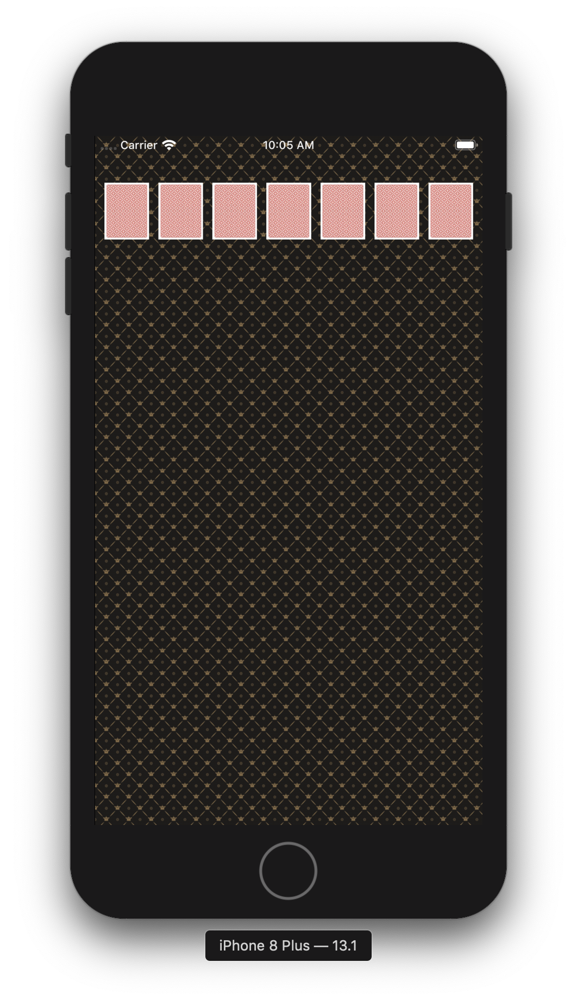

# swift-pokergameapp
STEP15 포커게임 앱 저장소

## 15-1 : 게임판 만들기

### 화면 이미지

### 핵심 기능

- 앱 기본 설정을 지정해서 StatusBar 스타일을 LightContent로 설정

- 코드로 화면을 균등하게 7등분해서 7개 UIImageView를 추가하고 카드 뒷면을 보여주게 설정 ( 카드 가로와 세로 비율은 1:1.27 )

### 학습 내용

- 화면 크기를 구하기 위해서 : UIScreen.main.bounds를 활용
- 코드로 View를 생성하고 화면에 추가하는 방식
- 앱 기본 설정(Info.plist)을 변경하는 방식

## 15-2 : 포커게임 결과 화면

### 화면 이미지

 위의 것처럼 완성해라.

### 핵심 기능

- Card 객체와 이미지 파일명을 매치하는 방법을 구현한다.
- CardDeck 인스턴스를 만들고 랜덤으로 카드를 섞고 출력 화면처럼 보이도록 개선한다.
- InputView에서 하던 동작을 버튼으로 만들어서 선택할 수 있도록 한다.
- OutputView에서 출력하던 카드 정보를 화면에 카드 이미지로 표시한다.
- 기존 코드를 최대한 활용하고, 게임의 승자를 화면에 표시한다.
- 앱에서 Shake 이벤트를 발생하면 랜덤 카드를 다시 섞고 다시 동작하도록 구현한다.
- // 아래는 학습내용
- Assets 으로 이미지를 관리하는 방법에 대해 학습한다.
- 디바이스 종류에 따라 화면 크기에 대한 처리를 학습한다. [관련 자료](https://www.paintcodeapp.com/news/ultimate-guide-to-iphone-resolutions)

### 학습 내용

