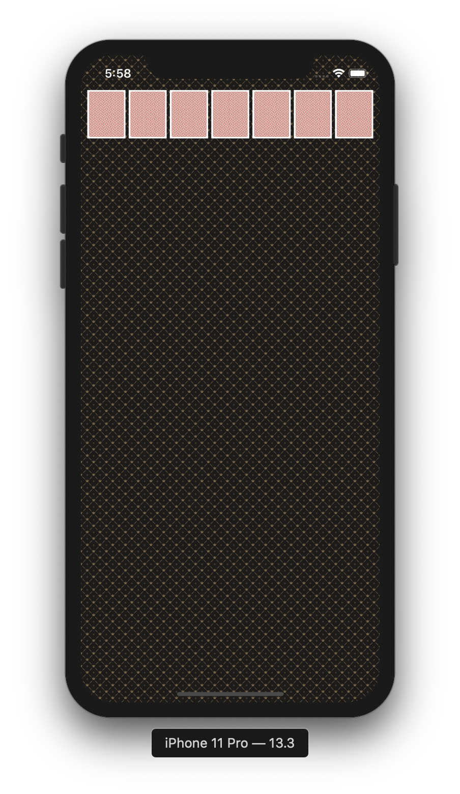
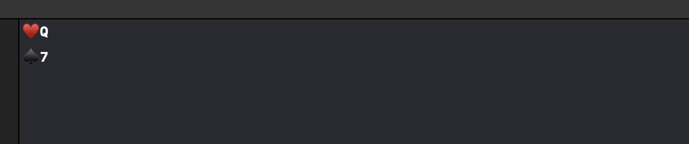
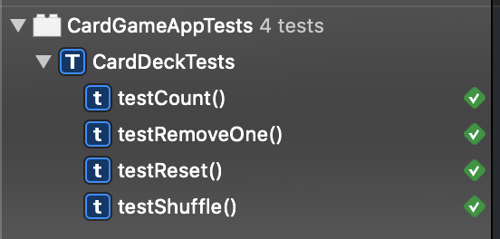
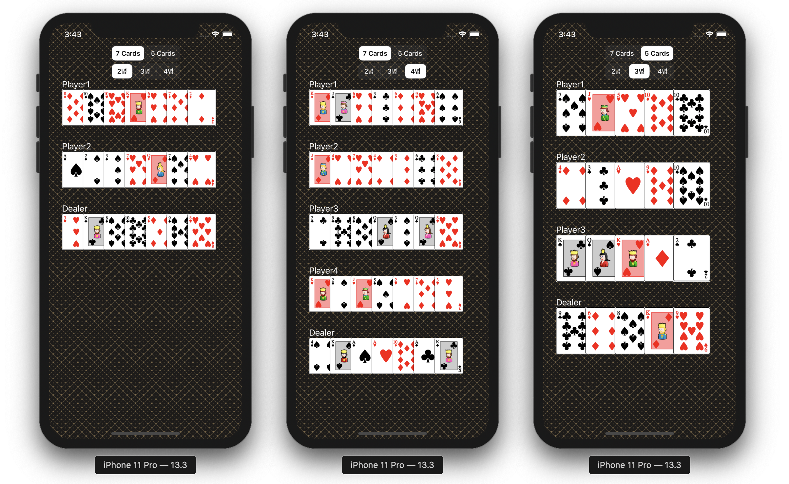
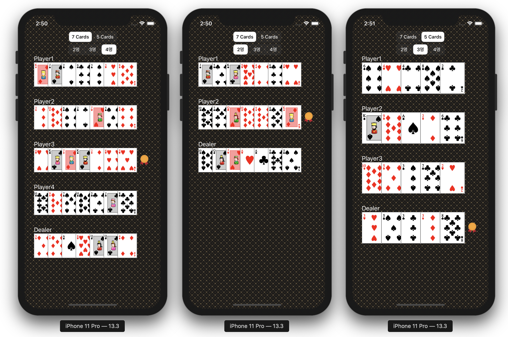

# PokerGameApp

포커게임 앱 저장소

## STEP1. 게임판 만들기

* 게임판 배경 패턴 설정
* 이미지뷰가 7개 들어가는 스택뷰를 생성하여 7개 카드 뒷면 디스플레이
* 오토 레이아웃을 이용하여 레이아웃

**실행 화면**

## STEP2. 카드 클래스

* 카드 클래스 설계
    * ♥️♣️♠️♦️ 중 하나의 모양을 가진다.
    * 숫자 1-13중 하나를 가지며, 1은 A, 11~13은 JQK이다.
    * 카드 정보 출력 기능 구현 및 확인

* 카드 클래스의 숫자 프로퍼티가 가질 수 있는 값을 한정시키기 위해 enum으로 변경
    * 프로퍼티 이름도 검색해서 rank로 변경

**실행 화면**

## STEP3. 카드덱 구현과 테스트

* 열거형이 CaseIterable을 따르도록 하고, 모든 case에 대해 열거형 인스턴스 생성해서 카드덱 초기화
* 카드덱 구조체의 removeone, reset, shuffle 메서드 구현 및 테스트

### 수정한 내용
* 셔플을 100% 확률로 테스트하기 위해 seed를 고정하여 실행할 때마다 같은 랜덤 넘버를 발생시키는 커스텀 랜덤 넘버 제너레이터를 구현
* 카드 덱의 셔플 함수에 Default Parameter Value를 이용하여 랜덤 넘버 제너레이터를 제공하지 않을 경우 시스템 기본 랜덤 넘버 제너레이터를 이용하도록 구현

### 또 수정한 내용
* 테스트와 실제 사용에서 같은 코드가 동작하게 하기 위해서 `RandomNumberGenerator`의 구현체를 항상 외부에서 넣어주는 방식으로 변경

**실행 결과**

## STEP4. 포커 딜러와 게임 플레이 구현 및 테스트

* 현재 게임 플레이 정보를 담고있는 GamePlay 클래스 구현
* 카드를 나눠주는 딜러 클래스 구현
* 게임플레이 클래스로 deal 메서드 이동.
* 게임플레이 테스트

### 수정한 내용

* Player 클래스 추상화
* 카드를 플레이어들에게 하나씩 나눠주는 함수 구현 및 이를 이용해 deal 메서드 구현
* 테스트 메서드 전체적으로 변경

## STEP5. 포커게임 UI 구성하기

* 커스텀 뷰 클래스를 이용하여 게임 모드를 선택하는 PlayModeSelectionView 구현
* 참가자 뷰를 나타내는 ParticipantView, 그 안의 겹쳐진 카드 뷰를 나타내는 Overlapped Card View 구현
* 딜리게이트 패턴을 이용하여 뷰의 사용자 액션을 컨트롤러에게 전달
* 컨트롤러에 모델 연결
* ParticipantView(참가자 뷰)들이 들어있는 스택뷰 구현
* 참가자 수에 맞게 스택뷰를 히든으로 처리
* 프로퍼티 감시자를 이용하여 뷰 컨텐츠 업데이트
* 카드 숫자에 맞게 스택뷰 히든 처리
* 카드 셔플 호출
* 디바이스 shake gesture 인식하여 카드 셔플

### 개선한 내용

* 테스트 코드에서 설명 없이 무작정 등장하는 상수(매직 넘버)를 이름 붙임.
* 넘버 포맷팅 딕셔너리를 타입 프로퍼티로 변경.
* 불필요한 argument lable 이름 간소화
* 클로저를 이용하여 열거형의 rawValue나 클래스의 내부 프로퍼티에 대한 의존성 제거

### 더 개선한 내용

* number formatting dictionary를 Rank로 옮기고, Rank 타입을 CustomStringConvertible 프로토콜을 따르도록 구현
* Suit도 CustomStringConvertible 프로토콜을 따르도록 구현
* descriptions에서 싱글톤 삭제하고, static 키워드 추가
* 클로저를 넘기는 메서드들을 동사형태로 네이밍 변경
* 뷰에서 데이터를 들고 있는 방식이 아니라 데이터를 들고있는 객체에게 물어봐서 업데이트하는 방식으로 변경
* 불필요한 타입 삭제

### 실행 결과

## STEP6. 승자 결정하기

* 승자 확인 어떻게할지 고민..
* 카드에 여러 프로토콜과 연산자 구현
* Hand 클래스 구현
    * 연속된 숫자 카운트
    * 딕셔너리를 이용해서 중복된 카드 겹치기 함수 구현
* Hand 클래스 테스트
    * 연속된 숫자 카운트 테스트
    * 중복된 카드 겹치기 함수 테스트
* 스코어 타입 구현
* Participant 클래스에서 Hand 클래스에서 구현한 메서드들을 이용하여 스코어 계산
* Participant 클래스 score 메서드 테스트
* 어떤 참가자가 승자인지 결정
* winner 뷰 업데이트

### 개선한 내용

* 어떤 생성자를 통해 뷰 인스턴스가 만들어져도 동일하게 동작하도록 수정.

### 더 개선한 내용

* Card의 빼기 연산자를 더 구체적으로 isNext로 변경.
* GamePlay의 승자 결정 로직의 역할을 분산시킴
    * 스코어의 priority 및 highest를 비교하는 역할을 Score에서 수행하도록 분산
    * [Score]에서 가장 높은 스코어와 가장 높은 카드를 구하는 역할을 Players에서 수행하도록 분산
    * winner 여부는 각 participant에서 갖고도록 변경
    * GamePlay에서는 가장 높은 스코어와 카드를 구하는 메서드와 score 비교 메서드를 이용하여 승자만 표시
* Players의 [Score]에서 가장 높은 스코어와 가장 높은 카드를 구하는 기능 테스트
* Gameplay의 승자 결정 테스트
* Participant에서 score 계산 시 switch문 간소화
* Descriptions를 StaticGameContents로 변경
* StaticGameContents에 상수 선언한 내용을 지움.
    * 이미 의미가 있는 것을 활용(이미 선언된 것을 활용)하기 위해 각 타입의 max값을 활용하도록 수정.
* 읽을 때(호출할 때)도 어떤 역할을 하는 상수인지 의도를 드러내기 위한 이름으로 수정

### 실행 결과

## STEP6.1 카드 Dealing 애니메이션 구현

* View Programming Guide for iOS의 Animation 파트 읽기
* Property Animator와 Key Frame Animation을 이용하여 한 hand를 animate
* 플레이어 순서대로 한장씩 나눠주도록 변경
* 모드 변경 시 애니메이션 정지
* 애니메이션 시작 전 뷰 투명하게 안되는 버그 수정하기
* 애니메이션이 끝난 후 승자 마크 업데이트
    * 전체 애니메이션이 끝나는 시점을 알기 위해 전체 애니메이션을 GamePlayView에서 관리하도록 변경
    * completion으로 승자 마크 업데이트하는 메서드 전달
* 애니메이션 시작 전 승자 마크 숨기기

### 개선한 내용

* Players.Number과 GamePlay.Rule의 max를 rawValue를 그대로 넘겨주지 않고 클로저를 넘겨받아 invoke하도록 수정
* 테스트 코드의 가독성 개선

### 실행 결과

