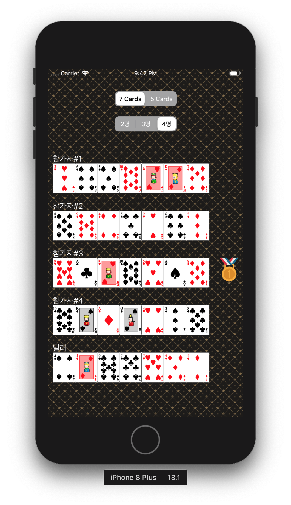

# swift-pokergameapp
STEP15 포커게임 앱 저장소

## 15-1 : 게임판 만들기

### 화면 이미지

### 핵심 기능

- 앱 기본 설정을 지정해서 StatusBar 스타일을 LightContent로 설정

- 코드로 화면을 균등하게 7등분해서 7개 UIImageView를 추가하고 카드 뒷면을 보여주게 설정 ( 카드 가로와 세로 비율은 1:1.27 )

### 학습 내용

- 화면 크기를 구하기 위해서 : UIScreen.main.bounds를 활용
- 코드로 View를 생성하고 화면에 추가하는 방식
- 앱 기본 설정(Info.plist)을 변경하는 방식

## 15-2 : 포커게임 결과 화면

### 화면 이미지

### 핵심 기능

- 랜덤으로 카드를 섞어서 나온 Card 객체와 이미지 파일명을 매치하여 설정
- UISegmentedControl을 활용하여 사용자의 선택에 따라 출력
- 앱에서 Shake 이벤트를 발생하면 랜덤 카드를 다시 섞고 다시 동작하도록 구현

### 학습 내용

- Assets 으로 이미지를 관리하는 방법에 대해 학습

### 구현하면서 어려웠던 점

- View 를 처리하는 방법이 어려웠다.

SuperView와 SubView 사이의 관계를 파악하는게 오래 걸렸다. 왜냐하면 SuperView가 모든 SubView의 정보를 다 가지고 있을꺼다. 라는 생각을 하지 못하고 그 상태를 어딘가에 저장을 하려고 했다. 

- 기존 코드를 최대한 활용해서 작성하는 부분이 어려웠다.

구조를 파악할때 내가 어떤걸 사용해야하고 무엇을 활용 해야할까? 라는 고민을 많이 하였다. 

