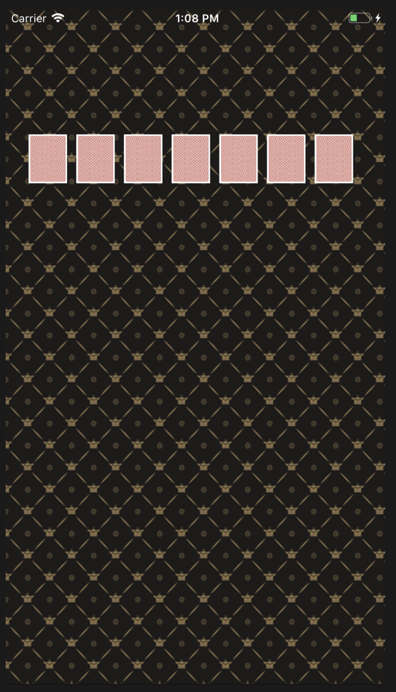

# swift-pokergameapp

## STEP 1

### 결과화면

<table style="margin: auto; text-align: center;">
  <tr colspan="2">
    <td>
        

          <b>세로모드</b>
        

    </td>
    <td >
        

          <b>가로모드</b>
        

    </td>
  </tr>
  <tr colspan="2">
    <td >  
      

        
      

    </td>
    <td>
      

        
      

    </td>
  </tr>
</table>

###구현 내용

- 코드레벨에서 오토레이아웃 제약 

- 스택 뷰 활용
- lightContent로 설정
- 백그라운드 이미지패턴(반복패턴) 적용

### 학습 내용

- NSLayoutConstraint
- view.centerXAnchor.constraint(equalTo: NSLayoutAnchor<NSLayoutXAxisAnchor>)
- UIColor.init(patternImage: )
- UIStackView

### Trials and Errors

#### 1) 제약 없이 center만 superview의 center와 맞춘 경우...

- 제약식 없이 만드는 경우, 이미지 뷰에 대한 매뉴얼 작업이 수반된다.
- 가로모드 적용시 틀이 깨지기도 함.

#### 2) not FillEqually

- stackview에 addArrangedSubview 적용시 `distribution`을  `.fillEqually ` 로 설정하지 않은 경우 + `spacing` 설정 안한 경우 그림이 깨져서 나타난다.
- spacing은 뷰의 인스턴스 프로퍼티로 존재한다.  ( UIStackView.Distribution.Spacing 이걸로 접근하지 말자.)
- 방법  height에 대한 제약식이 필요하다.

#### 3) centerX 제약 적용시 유의사항

- centerX 제약 추가시 width 제약을 누락하면 (혹은 leading이나 trailing) 스택뷰의 origin을 superview center로 잡는 문제상황이 발생할 수 있다.

### Feedback 수정 유의사항

- UIViewController의 Lifecycle에 따라 호출되는 메서드에 유의하고, viewWillAppear에 불필요하게 반복적으로 호출되는 로직을 개선할 것
  - 배경 이미지 패턴 로직을 viewDidLoad로 이동
- 숫자, 이미지에 대한 문자열 하드코딩을 제거
  - struct 구조로 모아두든지, viewController 내의 변수/구조체로 응집시킬 것

- 이미지 해상도에 대해 공부하기

## 1x 2x 3x Pixel/Point/

### Point

- 인쇄물 출력에 쓰이는 단위. 
- 1 inch를 72로 나눈 값을 의미한다.  72 pt = 1 inch || 1pt = 1/72 inch 

### Pixel

- (디스플레이 화면을 대상으로) 이미지를 이루는 가장 작은 단위
- 모니터 해상도를 위해 사용

Pixel == Point ?

- OS 에 따라 다름
  - Windows :> 9pt = 12px (96dpi ; 96 pixels per inch)
  - Mac :> 1pt = 1px (72 dpi ; 72 pixels per inch) 였음.
  - iPhone :> Retina display 도입으로 픽셀 개념을 도입하였음.
    -  1pt = 1px , 2px, 3px  로 기기마다 다르다.
    - 여기서 width, height 별로 각각 2배, 3배 늘어났으므로 실제로는 1pt = 4pixels, 1pt = 9pixels에 해당한다. 
    - 1pt = 1px ( normal display ;  iphone 4 이전)
    - 1pt = 2px ( retina display ; iphone 4~5)
    - 1pt = 3px ( retina HD display ; jphone 6~)
  - 개발자는 각각의 장치에 대해 고해상도 이미지를 제공해야 함.
    - 장치에 따라 각 이미지의 픽셀수에 특정 배율 인수를 곱해 이를 수행
    - 기기 디스플레이 조건에 따른 업스케일링(부족한 해상도를 디스플레이에 맞게 늘림)과 다운스케일링(넘치는 해상도를 디스플레이에 맞게 줄임)을 하면 메모리/디스크 사용이 비효율적이게 된다. 이를 방지하여 성능을 향상하기 위한 방안으로 이미지 슬라이싱 기법을 제공한다.

## Xcode xcassets (1x, 2x, 3x)

@1x image ( 100 x 100 pixels)가 주어졌다면

@2x image 에는 (200 x 200 px) 해상도의 이미지가 필요하고

@3x image 에는 (300 x 300 px) 가 필요하다.

> Asset catalogs **simplify access to app resources** by mapping between named assets and one or more files targeted **for different device attributes**. Attributes include **device characteristics, size classes, on-demand resources, and type-specific information.** The attributes are used to choose the best file for app slicing variants, and at runtime to choose the right image for the current screen orientation.
>
> 에셋 카탈로그는 에셋의 이름과 다양한 디바이스 **속성**을 매핑하여 앱의 리소스에 단순하게 접근하는 것이 가능하게 해줌.
>
> (디바이스) 속성들은 디바이스 특징, 사이즈, 온디맨드 리소스 여부, 특정 타입 정보들을 포함합니다.
>
> 이러한 속성들은 런타임에 앱 슬라이싱을 위한 최적의 파일을 선택하여 현재 스크린의 오리엔테이션에 대해 올바른 이미지를  보여주는데 사용됩니다.

- Assets에 저장된 이미지
- Asset의 이름은 unique 해야 함, 단 폴더 구조로 구분 가능
- 디렉토리 구조와 속성정보는 Contents.json 파일에 json 형식으로 저장됩니다.

### Ref

- https://developer.apple.com/library/archive/documentation/Xcode/Reference/xcode_ref-Asset_Catalog_Format/index.html#//apple_ref/doc/uid/TP40015170-CH18-SW1

- https://help.apple.com/xcode/mac/current/#/dev10510b1f7

  

- https://zeddios.tistory.com/6
- [MAC 에서의 포인트(pt)와 픽셀(px)의 관계 - 1x 2x 3x](https://zeddios.tistory.com/26)

## STEP 2

### 결과화면

### 주요 구현사항 및 학습내용

- **STEP 9 카드게임 리팩토링**

  - Player / Dealer 구분 및 프로토콜 추가
    - `extension`으로 채택 프로토콜 별 준수사항(메서드 구현) 분리
  - System에 의해서가 아닌 Dealer에 의한 카드배분으로 수정

  

- UIStoryboard 없이 **코드레벨에서만 UIComponents  생성**

  - autoLayout을 NSLayoutConstraint으로 생성
  - Stackview
  - UILabel
  - UISegmentedControl 
  - 게임 유형과 참여인원 값을 변경할 때마다 뷰가 변하도록 이벤트 핸들러 추가

  

- ViewController와 Model을 담는 **DataController 분리**

  - DataController는 ViewController의 프로퍼티로 존재
  - AppDelegate에서 setter Injection으로 DataController 를 ViewController에 주입
  - Target-Action으로 View -> Controller 이벤트 전달
  - Model -> Controller 업데이트 내역 전달은 NotificationCenter 활용하여 구현

  

- 기타 

  - 변수 값 하드코딩을 가급적 줄이기 위해 클래스 내부 구조체나 static 변수를 담은 구조체들을 생성하여 관리