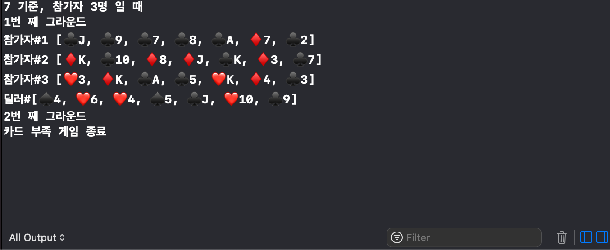

# 🃏 Pocker Game App

## Step01 - 게임판 만들기 (02/15 17:14)

### 실행 화면

## Status Bar -  LightContent

## Step02 - 카드 클래스 (02/16 11:40)

### 실행화면

Card 객체를 구조체로 구현해보았습니다. 

값의 참조방식을 위해 Class로 구현해야할 필요가 없었고
암시적 이니셜라이징이 가능해 따로 init을 구현해 주지 않아도 되어 편리하다 생각했습니다.

Nested Enum타입으로 Suit, Rank를 저장합니다.

## Step03 - 카드덱 구현과 테스트 (2/17 10:53)

### 실행 화면

### Struct , Class
struct는 대입 시 복제라는 큰 특징이 있고 이로 인해 불변성이 가능해지고 멀티스레드 안정성과 메모리 관리 안정성이라는 잇점을 얻게 됩니다.

[참고](http://seorenn.blogspot.com/2015/01/swift-memory-management-3-struct-class.html)

Struct 는 Value에 의해, Class는 Reference에 의해 

Class는 ARC에 의해 메모리 관리를 받는다.

## Step04 - 포커딜러와 게임테스트

### 실행 화면

